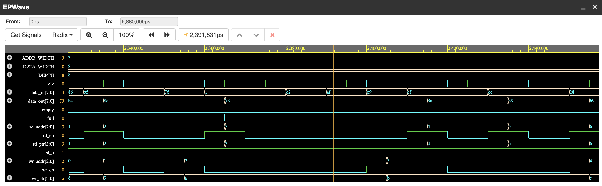

# Synchronous FIFO — Verilog

A parameterized, single-clock synchronous FIFO written in Verilog,
verified with a self-checking testbench (directed + randomized tests
cross-checked against a software reference model).

## Why this design

FULL/EMPTY detection uses the standard "extra MSB" pointer technique
instead of a separate counter — see [`docs/design_notes.md`](docs/design_notes.md)
for a worked explanation of why this is needed and how it works.

## Features
- Parameterized `DATA_WIDTH` and `DEPTH` (depth must be a power of 2)
- Single clock domain, active-low async reset
- Overflow/underflow protection (writes/reads are silently blocked, not corrupting the FIFO)

## Verification
- **166/166 automated checks passed**
- Directed tests: fill-to-full, drain-to-empty, overflow/underflow blocking
- Randomized test: 500 cycles of random read/write, every read validated
  against a software reference queue built inside the testbench

```
=========================================
 TEST SUMMARY: 166 PASSED, 0 FAILED
 RESULT: ALL TESTS PASSED
=========================================
```

## Repo structure
```
sync-fifo-verilog/
├── rtl/sync_fifo.v         # FIFO design
├── tb/sync_fifo_tb.v       # self-checking testbench
├── docs/design_notes.md    # full/empty pointer logic explained
├── waveforms/              # simulation waveform screenshot
└── README.md
```

## Run it yourself

**Locally (Icarus Verilog):**
```bash
iverilog -g2012 -o sim.out rtl/sync_fifo.v tb/sync_fifo_tb.v
vvp sim.out
gtkwave sync_fifo.vcd   # optional, view waveforms
```

**Online (no install):** run it on [EDA Playground](https://www.edaplayground.com/) —
paste `rtl/sync_fifo.v` as the design file and `tb/sync_fifo_tb.v` as
the testbench, select Icarus Verilog as the simulator, and click Run.

## Waveform

